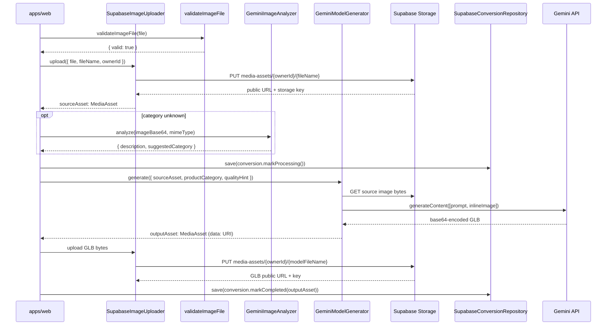

# AI Pipeline

## Pipeline overview



---

## Step 1 — Image intake

`validateImageFile` in `libs/core/src/lib/utils/file-validator.ts` runs before any network call.

Accepted MIME types: `image/jpeg`, `image/png`, `image/webp`.  
Maximum size: **10 MB** (`10 * 1024 * 1024` bytes).

Any other type or an oversized file returns `{ valid: false, reason: '...' }`. The app renders the reason in the UI and does not proceed to upload.

---

## Step 2 — Image analysis (optional)

`GeminiImageAnalyzer` in `libs/ai/src/lib/gemini/gemini-image-analyzer.ts` sends the source image to `ANALYSIS_MODEL_ID` (`gemini-1.5-pro`) with a structured JSON prompt.

The response is a JSON object:

```json
{
  "description": "a wooden dining chair with four legs",
  "suggestedCategory": "furniture"
}
```

This step is optional. Skip it when the product category is already known (e.g., the user selected it in a form). Run it to pre-fill the category field from the image.

---

## Step 3 — 3D generation

`GeminiModelGenerator.generate()` in `libs/ai/src/lib/gemini/gemini-3d-generator.ts` handles the main conversion.

`buildConvert2DTo3DPrompt(productCategory, quality)` in `libs/ai/src/lib/prompts/convert-2d-to-3d.prompt.ts` produces the generation prompt. The prompt instructs Gemini to:

- Analyse shape, materials, and proportions.
- Apply quality-hint-specific polygon density (`fast` / `balanced` / `quality`).
- Output a binary glTF file (GLB), Y-up, origin-centred, real-world scale in metres.
- Include PBR materials with base colour, roughness, and metallic maps.

The source image is fetched by URL, converted to a `Uint8Array`, and base64-encoded. It is sent to the Gemini API as `inlineData` alongside the text prompt.

---

## Step 4 — GLB extraction

Gemini responds with a base64-encoded GLB string. `GeminiModelGenerator` decodes it:

```ts
const glbBytes = Uint8Array.from(atob(glbBase64), c => c.charCodeAt(0))
```

A `MediaAsset` is constructed with a `data:model/gltf-binary;base64,...` URL. The `storageKey` is intentionally empty at this point — the caller is responsible for uploading the GLB to Supabase Storage and replacing the `MediaAsset` with the resulting public URL.

`tokensUsed` is read from `result.response.usageMetadata?.totalTokenCount` and returned for cost tracking.

---

## Step 5 — Storage upload

`SupabaseImageUploader.upload()` handles both source images and generated GLB binaries. The storage object path follows the pattern `{ownerId}/{fileName}`. Supabase Storage enforces this via the `media_assets_owner_upload` policy:

```sql
(storage.foldername(name))[1] = auth.uid()::text
```

After upload, Supabase returns a public URL. This URL and the storage key are packed into a new `MediaAsset` instance that replaces the temporary `data:` URI.

---

## Token usage tracking

`GeminiModelGenerator.generate()` returns `tokensUsed: number` in `GenerateModelOutput`. Store this on the `Conversion` aggregate or log it to a separate analytics table if you need cost monitoring.

---

## Error handling and retry strategy

`Conversion.markFailed(reason)` transitions any non-terminal state to `failed` and stores the error message. The app calls this on any exception thrown by `GeminiModelGenerator.generate()`.

::: warning No automatic retry
The pipeline performs a single attempt. If Gemini returns a quota error or a malformed response, the conversion is marked `failed`. The user must create a new conversion to retry. Implementing exponential back-off retry is left for post-hackathon scope.
:::

::: tip Rate limits
`gemini-2.0-flash-exp` has free-tier quotas. If you hit `429 Too Many Requests`, wait 60 seconds before retrying. The `ANALYSIS_MODEL_ID` (`gemini-1.5-pro`) has separate quotas.
:::
