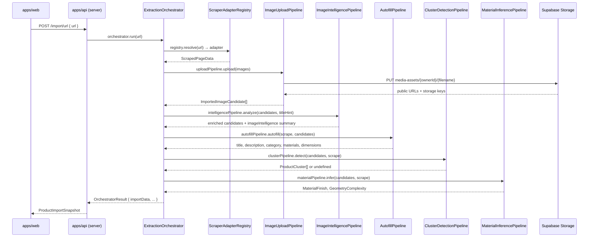

# APUS Pipeline

APUS (Autonomous Product Understanding System) is the multi-stage pipeline that turns a raw product URL into a fully-structured `ProductImportData` record ready for 3D conversion.

---

## Architecture overview



---

## Stage 1 — URL resolution and scraping

`ScraperAdapterRegistry.resolve(url)` selects the best adapter for the domain:

| Adapter | Domain match | Support level |
|---|---|---|
| `AmazonAdapter` | `amazon.*` | `supported` |
| `IkeaAdapter` | `ikea.*` | `supported` |
| `GenericAdapter` | any other domain | `best_effort` |
| `MockAdapter` | test / localhost | `mock` |

Each adapter implements `IPageScraperAdapter` from `libs/core/src/lib/adapters/ports/page-scraper.port.ts` and returns a `ScrapedPageData` object containing text fields, image candidates, and page-region hints.

---

## Stage 2 — Image upload

`ImageUploadPipeline` iterates the scraped image list, downloads each image, and uploads it to the `media-assets` Supabase Storage bucket under `{ownerId}/{hash}.{ext}`. Candidates that fail to download are kept in the list with a `failureReasons` entry so downstream stages know to skip them.

---

## Stage 3 — Image intelligence (Gemini Flash)

`ImageIntelligencePipeline` wraps `GeminiImageClassifier` and `ImageDeduplicationService`:

1. **Classification** — `GeminiImageClassifier.classifyBatch()` sends all successfully uploaded images to `gemini-2.0-flash-exp` in a single multimodal call. Each image receives an `imageClass` (`product-hero`, `lifestyle`, `logo`, …), a `viewAngle`, a `relevanceScore`, and an `aiRejected` flag.
2. **Deduplication** — `ImageDeduplicationService` computes a perceptual hash for each non-rejected image and removes near-duplicates by Hamming distance, keeping the highest-resolution copy.

This stage is **graceful**: if Gemini returns an error or quota is exhausted, the pipeline proceeds with unclassified candidates.

---

## Stage 4 — Autofill (Gemini Pro)

`AutofillPipeline` sends the scraped text and representative image thumbnails to `gemini-1.5-pro` using the deep-product-autofill prompt. It fills any field the scraper left blank:

- **title** — cleaned and de-duplicated from the page `<title>`
- **description** — truncated to 700 characters
- **category** — mapped to the seven `ProductCategory` values
- **materials** — comma-separated list inferred from image and text
- **dimensions** — extracted from the specification table or description

Each field is tagged with a `confidence` score (`high` / `medium` / `low`) and its `source` (`scraper` / `ai`).

---

## Stage 5 — Multi-product cluster detection (Gemini Flash)

Cluster detection runs when the title suggests a bundle (`&`, `+`, "set", "bundle") or when three or more non-rejected images remain after intelligence.

`GeminiProductClusterAnalyzer` groups images by product identity and returns a `ProductCluster[]`. Each cluster has its own `title`, `description`, `category`, and image list. The seller picks the primary cluster on the review screen; the others are discarded.

---

## Stage 6 — Material and geometry inference (Gemini Flash)

`MaterialInferencePipeline` wraps `GeminiMaterialInferenceEngine`, which sends the hero and detail images to Gemini and returns:

- `inferredMaterialFinish` — one of `matte`, `glossy`, `brushed-metal`, `fabric`, `glass`, `wood`, `ceramic`, `leather`, `unknown`
- `inferredGeometryComplexity` — one of `simple`, `moderate`, `complex`, `compound`

These values guide the 3D generation quality hint in the next phase.

---

## Field confidence and conflict audit trail

Every text field in `ProductImportData.fields` is an `ImportedField<T>`:

```ts
interface ImportedField<T> {
  value: T;
  confidence: 'high' | 'medium' | 'low';
  source: 'scraper' | 'ai' | 'seller';
  aiSuggested?: boolean;
  editedBySeller?: boolean;
  originalValue?: T;
}
```

When the scraper and AI disagree on a field value, the conflict is recorded in `fieldConflicts` for audit. The `buildField` helper in `orchestrator.ts` prefers scraper data when present and marks the AI value as a suggestion.

---

## Graceful degradation

All stages after image upload run inside `try/catch` blocks. A Gemini quota error or malformed response does not abort the import — the pipeline produces a valid `ProductImportData` with whatever it managed to infer. The seller's review screen flags incomplete fields so they can fill them in manually.

---

## Adapter development

To add a new supported domain, implement `IPageScraperAdapter`:

```ts
import type { IPageScraperAdapter, ScrapedPageData } from '@minimalblock/core';

export class MyShopAdapter implements IPageScraperAdapter {
  readonly supportLevel = 'supported';

  canHandle(url: URL): boolean {
    return url.hostname.endsWith('myshop.com');
  }

  async scrape(url: URL): Promise<ScrapedPageData> {
    // fetch HTML, parse structured data, return ScrapedPageData
  }
}
```

Then register it in `ScraperAdapterRegistry` before the generic fallback.
