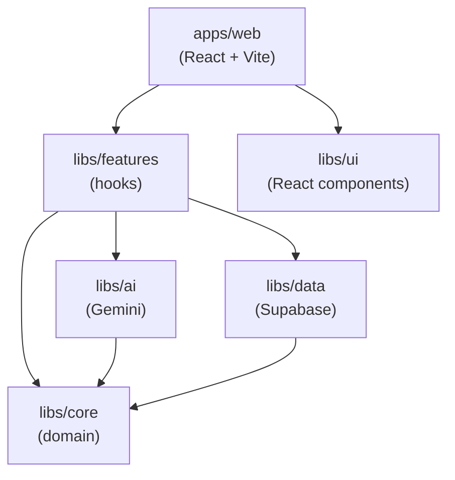

# Architecture

## Layer diagram

Each arrow represents a compile-time dependency (`import`). `libs/core` has no outward arrows — it is the dependency root.

---

## Dependency rules

### core has no outward dependencies

`libs/core` contains only domain code: entities, value objects, aggregates, and port interfaces. It imports nothing from other workspace packages. This makes the domain portable and testable without any runtime infrastructure.

### ai and data depend only on core ports

`libs/ai` implements `IModelGeneratorPort`. `libs/data` implements `IProductRepository`, `IConversionRepository`, and `IImageUploaderPort`. Both import from `libs/core` and from their respective third-party SDKs (`@google/generative-ai`, `@supabase/supabase-js`). Neither imports from the other.

### features composes core + ai + data

`libs/features` provides React hooks that wire domain logic to infrastructure. It depends on all three foundational libraries. It does not render UI.

### ui carries no business logic

`libs/ui` exports React components with no knowledge of Supabase, Gemini, or domain models. Props are primitive-typed or use lightweight interfaces defined within the lib.

### web app composes all layers

`apps/web` imports from `libs/features` (state) and `libs/ui` (presentation). It instantiates the infrastructure adapters (Supabase client, Gemini client) and injects them into hooks at startup.

---

## Domain model

### Aggregates and entities

`Conversion` is the sole aggregate root. It encapsulates the full lifecycle of a single 2D-to-3D job and enforces valid state transitions via `markProcessing()`, `markCompleted()`, and `markFailed()`.

`Product` is an entity that represents the e-commerce catalogue item. A product can have many conversions over time; the most recent `completed` conversion provides the 3D model displayed in the UI.

`User` is a thin entity used only for ownership checks (`product.isOwnedBy(userId)`).

### Value objects

`MediaAsset` holds the URL, storage key, MIME type, kind (`source-image` or `generated-model`), and size in bytes for any binary media file. It is immutable. Two `MediaAsset` instances with identical fields are logically equal.

`ConversionStatus` represents the four lifecycle states as an object rather than a raw string. Predicates like `isTerminal()` encapsulate transition rules that would otherwise be scattered across the codebase.

### Port interfaces

The four port interfaces in `libs/core/src/lib/adapters/ports/` define the contracts that infrastructure must satisfy. The domain never imports an implementation — it depends only on the interface. This is the ports-and-adapters (hexagonal) pattern.

---

## Why ports-and-adapters

The primary benefit in this project is **testability without infrastructure**. Domain logic — `Conversion.markCompleted()`, `Product.isOwnedBy()`, `validateImageFile()` — can be unit-tested with no Supabase project and no Gemini API key. Mock implementations of the port interfaces substitute for the real adapters.

The secondary benefit is **swappability**. Replacing Supabase with another database, or Gemini with another AI provider, requires implementing the relevant port interface. The rest of the codebase does not change.
