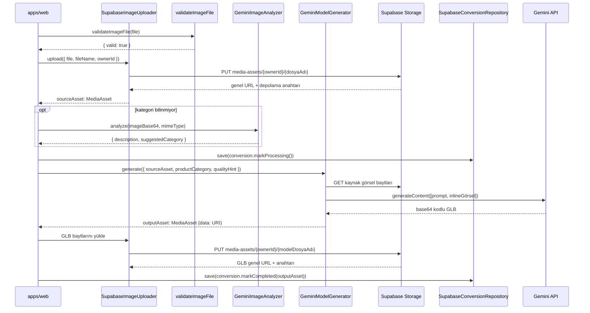

# Yapay Zeka Boru Hattı

## Boru hattına genel bakış



---

## 1. Adım — Görsel alımı

`validateImageFile`, `libs/core/src/lib/utils/file-validator.ts` dosyasında, herhangi bir ağ çağrısından önce çalışır.

Kabul edilen MIME türleri: `image/jpeg`, `image/png`, `image/webp`.  
Maksimum boyut: **10 MB** (`10 * 1024 * 1024` bayt).

Desteklenmeyen bir tür veya çok büyük bir dosya, `{ valid: false, reason: '...' }` döndürür. Uygulama nedeni kullanıcı arayüzünde gösterir ve yükleme işlemine devam etmez.

---

## 2. Adım — Görsel analizi (isteğe bağlı)

`libs/ai/src/lib/gemini/gemini-image-analyzer.ts` dosyasındaki `GeminiImageAnalyzer`, kaynak görseli yapılandırılmış bir JSON prompt'uyla `ANALYSIS_MODEL_ID`'ye (`gemini-1.5-pro`) gönderir.

Yanıt bir JSON nesnesidir:

```json
{
  "description": "dört ayaklı ahşap yemek sandalyesi",
  "suggestedCategory": "furniture"
}
```

Bu adım isteğe bağlıdır. Ürün kategorisi zaten biliniyorsa (örn. kullanıcı bir formda seçtiyse) atlayın. Kategori alanını görselden önceden doldurmak için kullanın.

---

## 3. Adım — 3D üretimi

`libs/ai/src/lib/gemini/gemini-3d-generator.ts` dosyasındaki `GeminiModelGenerator.generate()` ana dönüşümü gerçekleştirir.

`libs/ai/src/lib/prompts/convert-2d-to-3d.prompt.ts` dosyasındaki `buildConvert2DTo3DPrompt(productCategory, quality)`, üretim prompt'unu oluşturur. Prompt, Gemini'ye şunları söyler:

- Şekli, materyalleri ve oranları analiz et.
- Kalite ipucuna özgü poligon yoğunluğu uygula (`fast` / `balanced` / `quality`).
- İkili bir glTF dosyası (GLB) çıkar; Y-yukarı, orijin merkezli, metre cinsinden gerçek dünya ölçeği.
- Fotoğraftan türetilmiş temel renk, pürüzlülük ve metalik haritalarla PBR materyaller ekle.

Kaynak görsel URL ile getirilir, `Uint8Array`'e dönüştürülür ve base64 kodlanır. Metin prompt'uyla birlikte `inlineData` olarak Gemini API'sine gönderilir.

---

## 4. Adım — GLB çıkarımı

Gemini, base64 kodlu bir GLB dizesiyle yanıt verir. `GeminiModelGenerator` bunu çözer:

```ts
const glbBytes = Uint8Array.from(atob(glbBase64), c => c.charCodeAt(0))
```

`data:model/gltf-binary;base64,...` URL'siyle bir `MediaAsset` oluşturulur. Bu noktada `storageKey` kasıtlı olarak boştur — çağıranın GLB'yi Supabase Storage'a yükleyip genel URL ile elde edilen `MediaAsset`'i değiştirmesi gerekir.

`tokensUsed`, maliyet takibi için `result.response.usageMetadata?.totalTokenCount` değerinden okunarak döndürülür.

---

## 5. Adım — Depolama yüklemesi

`SupabaseImageUploader.upload()`, hem kaynak görsellerini hem de oluşturulan GLB ikili verilerini işler. Depolama nesnesi yolu `{owner_id}/{dosya_adı}` kalıbını izler. Supabase Storage bunu `media_assets_owner_upload` politikasıyla zorlar:

```sql
(storage.foldername(name))[1] = auth.uid()::text
```

Yükleme sonrasında Supabase, genel bir URL döndürür. Bu URL ve depolama anahtarı, geçici `data:` URI'sinin yerini alan yeni bir `MediaAsset` örneğine yerleştirilir.

---

## Token kullanımı takibi

`GeminiModelGenerator.generate()`, `GenerateModelOutput`'ta `tokensUsed: number` döndürür. Maliyet izleme istiyorsanız bunu `Conversion` aggregate'inde saklayın veya ayrı bir analitik tablosuna kaydedin.

---

## Hata yönetimi ve yeniden deneme stratejisi

`Conversion.markFailed(reason)`, terminal olmayan herhangi bir durumu `failed`'a geçirir ve hata mesajını saklar. Uygulama, `GeminiModelGenerator.generate()` tarafından fırlatılan herhangi bir istisnada bunu çağırır.

::: warning Otomatik yeniden deneme yok
Boru hattı tek bir deneme gerçekleştirir. Gemini bir kota hatası veya hatalı biçimlendirilmiş yanıt döndürürse dönüşüm `failed` olarak işaretlenir. Kullanıcının yeniden denemek için yeni bir dönüşüm oluşturması gerekir. Üstel geri çekilme ile yeniden deneme uygulamak, hackathon sonrası kapsam için bırakılmıştır.
:::

::: tip Hız sınırları
`gemini-2.0-flash-exp`'nin ücretsiz plan kotaları vardır. `429 Too Many Requests` (Çok Fazla İstek) hatasıyla karşılaşırsanız yeniden denemeden önce 60 saniye bekleyin. `ANALYSIS_MODEL_ID` (`gemini-1.5-pro`) ayrı kotaları vardır.
:::
