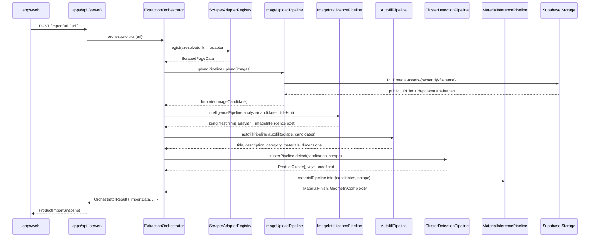

# APUS Pipeline

APUS (Autonomous Product Understanding System — Özerk Ürün Anlama Sistemi), ham bir ürün URL'sini 3D dönüştürmeye hazır, tam yapılandırılmış bir `ProductImportData` kaydına dönüştüren çok aşamalı pipeline'dır.

---

## Mimariye genel bakış



---

## Aşama 1 — URL çözümleme ve sayfa kazıma

`ScraperAdapterRegistry.resolve(url)`, domain için en uygun adaptörü seçer:

| Adaptör | Domain eşleşmesi | Destek seviyesi |
|---|---|---|
| `AmazonAdapter` | `amazon.*` | `supported` |
| `IkeaAdapter` | `ikea.*` | `supported` |
| `GenericAdapter` | diğer tüm domainler | `best_effort` |
| `MockAdapter` | test / localhost | `mock` |

Her adaptör `libs/core/src/lib/adapters/ports/page-scraper.port.ts` içindeki `IPageScraperAdapter` arayüzünü uygular ve metin alanlarını, görsel adaylarını ve sayfa bölgesi ipuçlarını içeren bir `ScrapedPageData` nesnesi döndürür.

---

## Aşama 2 — Görsel yükleme

`ImageUploadPipeline`, kazınan görsel listesini dolaşır, her görseli indirir ve `{ownerId}/{hash}.{ext}` yolu altında Supabase Storage `media-assets` bucket'ına yükler. İndirilemeyen adaylar, aşağı akış aşamalarının bunları atlayabilmesi için `failureReasons` girişiyle listede tutulur.

---

## Aşama 3 — Görsel zekası (Gemini Flash)

`ImageIntelligencePipeline`, `GeminiImageClassifier` ve `ImageDeduplicationService`'i bir araya getirir:

1. **Sınıflandırma** — `GeminiImageClassifier.classifyBatch()`, başarıyla yüklenen tüm görselleri tek bir multimodal çağrıyla `gemini-2.0-flash-exp`'e gönderir. Her görsel bir `imageClass` (`product-hero`, `lifestyle`, `logo`, …), `viewAngle`, `relevanceScore` ve `aiRejected` bayrağı alır.
2. **Tekilleştirme** — `ImageDeduplicationService` her reddedilmemiş görsel için algısal karma hesaplar ve Hamming mesafesine göre neredeyse aynı görselleri kaldırarak en yüksek çözünürlüklü kopyayı saklar.

Bu aşama **hata toleranslıdır**: Gemini bir hata döndürürse veya kota tükenirse pipeline, sınıflandırılmamış adaylarla devam eder.

---

## Aşama 4 — Otomatik doldurma (Gemini Pro)

`AutofillPipeline`, kazınan metni ve temsili görsel küçük resimlerini `gemini-1.5-pro`'ya deep-product-autofill istemi aracılığıyla gönderir. Kazıyıcının boş bıraktığı alanları doldurur:

- **title** — sayfa `<title>`'ından temizlenip tekilleştirilmiş
- **description** — 700 karaktere kısaltılmış
- **category** — yedi `ProductCategory` değerinden birine eşlenmiş
- **materials** — görsel ve metinden çıkarılmış virgülle ayrılmış liste
- **dimensions** — özellikler tablosundan veya açıklamadan çıkarılmış

Her alan, `confidence` skoru (`high` / `medium` / `low`) ve `source` bilgisi (`scraper` / `ai`) ile etiketlenir.

---

## Aşama 5 — Çok ürünlü küme tespiti (Gemini Flash)

Küme tespiti, başlık bir paket ürüne işaret ettiğinde (`&`, `+`, "set", "bundle") ya da zeka aşamasından sonra üç veya daha fazla reddedilmemiş görsel kaldığında çalışır.

`GeminiProductClusterAnalyzer`, görselleri ürün kimliğine göre gruplar ve bir `ProductCluster[]` döndürür. Her kümenin kendi `title`, `description`, `category` ve görsel listesi vardır. Satıcı, inceleme ekranında birincil kümeyi seçer; diğerleri silinir.

---

## Aşama 6 — Malzeme ve geometri çıkarımı (Gemini Flash)

`MaterialInferencePipeline`, `GeminiMaterialInferenceEngine`'i sarar; bu motor kahraman ve detay görsellerini Gemini'ye gönderir ve şunları döndürür:

- `inferredMaterialFinish` — `matte`, `glossy`, `brushed-metal`, `fabric`, `glass`, `wood`, `ceramic`, `leather`, `unknown` değerlerinden biri
- `inferredGeometryComplexity` — `simple`, `moderate`, `complex`, `compound` değerlerinden biri

Bu değerler, bir sonraki aşamada 3D üretim kalite ipucunu belirler.

---

## Alan güveni ve çakışma denetim izi

`ProductImportData.fields` içindeki her metin alanı bir `ImportedField<T>`'dir:

```ts
interface ImportedField<T> {
  value: T;
  confidence: 'high' | 'medium' | 'low';
  source: 'scraper' | 'ai' | 'seller';
  aiSuggested?: boolean;
  editedBySeller?: boolean;
  originalValue?: T;
}
```

Kazıyıcı ve yapay zeka bir alan değerinde anlaşamadığında, çakışma denetim için `fieldConflicts` içine kaydedilir. `orchestrator.ts` içindeki `buildField` yardımcısı, mevcut olduğunda kazıyıcı verisini tercih eder ve yapay zeka değerini öneri olarak işaretler.

---

## Kademeli bozulma

Görsel yüklemeden sonraki tüm aşamalar `try/catch` blokları içinde çalışır. Bir Gemini kota hatası veya hatalı biçimlendirilmiş yanıt içe aktarmayı durdurmaz — pipeline, çıkarmayı başardığı her şeyle geçerli bir `ProductImportData` üretir. Satıcının inceleme ekranı, eksik alanları işaretler ve elle doldurulabilmelerini sağlar.

---

## Adaptör geliştirme

Yeni bir desteklenen domain eklemek için `IPageScraperAdapter`'ı uygulayın:

```ts
import type { IPageScraperAdapter, ScrapedPageData } from '@minimalblock/core';

export class BenimMağazamAdaptörü implements IPageScraperAdapter {
  readonly supportLevel = 'supported';

  canHandle(url: URL): boolean {
    return url.hostname.endsWith('benimmagazam.com');
  }

  async scrape(url: URL): Promise<ScrapedPageData> {
    // HTML'yi çek, yapısal veriyi ayrıştır, ScrapedPageData döndür
  }
}
```

Ardından `ScraperAdapterRegistry`'ye genel geri dönüş adaptöründen önce kaydedin.
