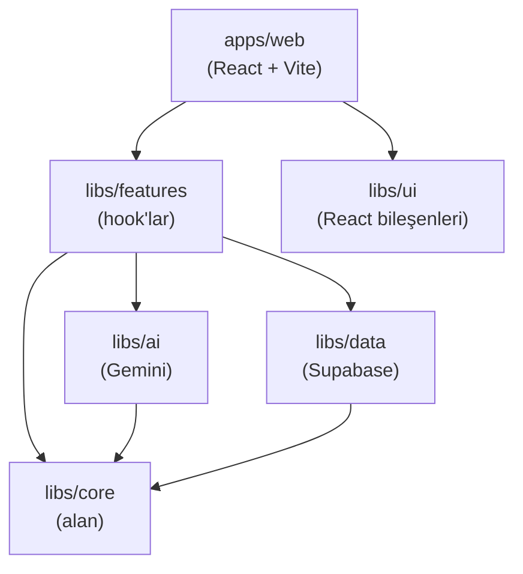

# Mimari

## Katman diyagramı

Her ok, derleme zamanı bağımlılığını (`import`) temsil eder. `libs/core`'un dışa giden oku yoktur — bağımlılık kökü odur.

---

## Bağımlılık kuralları

### core dışa bağımlılık taşımaz

`libs/core` yalnızca alan kodunu içerir: varlıklar, değer nesneleri, aggregate'ler ve port arayüzleri. Diğer çalışma alanı paketlerinden hiçbir şey içe aktarmaz. Bu, alanı taşınabilir ve herhangi bir çalışma zamanı altyapısı olmadan test edilebilir kılar.

### ai ve data yalnızca core portlarına bağlıdır

`libs/ai`, `IModelGeneratorPort`'u uygular. `libs/data`, `IProductRepository`, `IConversionRepository` ve `IImageUploaderPort`'u uygular. Her ikisi de `libs/core`'dan ve ilgili üçüncü taraf SDK'larından içe aktarır (`@google/generative-ai`, `@supabase/supabase-js`). Biri diğerinden içe aktarmaz.

### features; core, ai ve data'yı bir araya getirir

`libs/features`, alan mantığını altyapıya bağlayan React hook'ları sağlar. Üç temel kitaplığın tümüne bağlıdır. Kullanıcı arayüzü render etmez.

### ui iş mantığı bağımlılığı taşımaz

`libs/ui`, Supabase, Gemini veya alan modelleri hakkında bilgi sahibi olmayan React bileşenleri dışa aktarır. Props'lar ilkel tiplerle veya kitaplık içinde tanımlanan hafif arayüzlerle belirtilir.

### web uygulaması tüm katmanları bir araya getirir

`apps/web`, `libs/features`'tan (durum) ve `libs/ui`'dan (sunum) içe aktarır. Başlangıçta altyapı adaptörlerini (Supabase istemcisi, Gemini istemcisi) başlatır ve bunları hook'lara enjekte eder.

---

## Alan modeli

### Aggregate'ler ve varlıklar

`Conversion`, tek aggregate köküdür. Tek bir 2B-to-3D işinin tüm yaşam döngüsünü kapsar ve `markProcessing()`, `markCompleted()` ve `markFailed()` aracılığıyla geçerli durum geçişlerini uygular.

`Product`, e-ticaret katalog öğesini temsil eden bir varlıktır. Bir ürünün zaman içinde birden fazla dönüşümü olabilir; en son `completed` dönüşüm, kullanıcı arayüzünde gösterilen 3D modeli sağlar.

`User`, yalnızca sahiplik kontrolleri için kullanılan ince bir varlıktır (`product.isOwnedBy(userId)`).

### Değer nesneleri

`MediaAsset`, herhangi bir ikili medya dosyası (kaynak görsel veya oluşturulan GLB) için URL'yi, depolama anahtarını, MIME türünü, türü (`source-image` veya `generated-model`) ve bayt cinsinden boyutu tutar. Değişmezdir. Aynı alanlara sahip iki `MediaAsset` örneği mantıksal olarak eşittir.

`ConversionStatus`, dört yaşam döngüsü durumunu ham bir dize yerine nesne olarak temsil eder. `isTerminal()` gibi koşullar, aksi takdirde kod tabanına dağılacak geçiş kurallarını kapsar.

### Port arayüzleri

`libs/core/src/lib/adapters/ports/` içindeki dört port arayüzü, altyapının karşılaması gereken sözleşmeleri tanımlar. Alan hiçbir zaman bir uygulama içe aktarmaz — yalnızca arayüze bağımlıdır. Bu, port ve adaptör (altıgen) modelidir.

---

## Neden port ve adaptör mimarisi

Bu projedeki temel fayda, **altyapısız test edilebilirliktir**. Alan mantığı — `Conversion.markCompleted()`, `Product.isOwnedBy()`, `validateImageFile()` — herhangi bir Supabase projesi ve Gemini API anahtarı olmadan milisaniyeler içinde birim test edilebilir. Port arayüzlerinin sahte uygulamaları, gerçek adaptörlerin yerine geçer.

İkincil fayda ise **değiştirilebilirliktir**. Supabase'i başka bir veritabanıyla veya Gemini'yi başka bir yapay zeka sağlayıcısıyla değiştirmek, ilgili port arayüzünü uygulamayı gerektirir. Kod tabanının geri kalanı değişmez.
